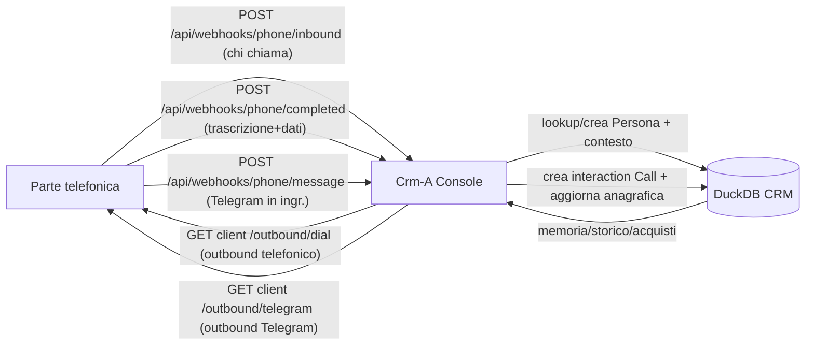

# Webhook contratto — Parte telefonica ↔ Crm-A Console (harness)

**Modello**: la parte telefonica pilota e fa l'AI della conversazione. La Crm-A Console **non pilota la chiamata**: per ogni evento ricevuto via webhook risponde **con i dati** (lookup/creazione Persona) e **intraprende le azioni** (registra eventi, aggiorna anagrafica, lancia outbound). Ottimizzato sul flusso della demo (lancio Samsung Galaxy).

- Auth: **solo Bearer token** (pattern `timingSafeEqual` di `poll-tick/route.ts`).
- 3 ingressi (provider → harness), 2 outgress (harness → provider).



---

## 1. Auth (decisione chiusa)

```
Authorization: Bearer <secret>
Content-Type: application/json
```
- `secret` in config/env; confronto costante nel tempo (`crypto.timingSafeEqual`, riuso pattern `apps/web/app/api/sync/poll-tick/route.ts`).
- Errori: mancante → `401`; errato → `401`.

---

## 2. Ingresso 1 — Inbound call (Atto 1 e Atto 5)

```http
POST /api/webhooks/phone/inbound
Authorization: Bearer ...
```
```jsonc
{
  "action": "inbound",              // discrimina l'evento
  "callId": "vc-20260806-0001",     // idempotenza
  "channel": "phone",
  "from": { "phone": "+393323000000", "name": null },  // E.164
  "at": "2026-08-06T10:00:00Z"
}
```
Harness:
1. `findPersonIdByPhone(e164)` → se assente, **crea** Persona (`Source=Manual`, `Phone Number`).
2. Compone il **contesto** per l'AI telefonica (profilo + acquisti + preferenze).
3. Apre/sospende la **sessione agente** per il contatto (`phone:<e164>`), per la memoria cross-chiamata.

Risposta `200`:
```jsonc
{
  "person": {
    "id": "seed_obj_people_...",
    "name": "Lorenzo",
    "email": "lorenzo@example.com",
    "phone": "+393323000000",
    "status": "Active",
    "preferredContact": "telegram",
    "lastOrder": {
      "product": "Samsung Galaxy S26",
      "orderedAt": "2026-07-12",
      "deliveryStatus": "in-transit"
    }
  },
  "matched": "existing" | "new" | "created",
  "context": "Cliente esistente: Lorenzo, ha acquistato Galaxy S26 il 12/07, consegna in corso. Chiama per info sul lancio Galaxy S27. Preferenza Telegram, opt-in marketing già dato.",
  "callStatus": "continue" | "end"     // es. se numero in blacklist → end
}
```
- `matched:"created"` → `person.id` nuovo, `context` minimo ("contatto sconosciuto"), l'AI procede come anonimo.
- **Demo (Atto 1)**: numero ignoto, `context` dice "sconosciuto"; all'inizio non c'è lastOrder.
- **Demo (Atto 5)**: Lorenzo richiama → `context` contiene "Bentornato Lorenzo… Galaxy acquistato il 12/10… corriere in carico oggi, consegna domani entro le 18" (l'AI telefonica lo pronuncia).

---

## 3. Ingresso 2 — Call completed (fine chiamata: registra tutto)

```http
POST /api/webhooks/phone/completed
Authorization: Bearer ...
```
```jsonc
{
  "action": "completed",
  "callId": "vc-20260806-0001",
  "channel": "phone",
  "from": { "phone": "+393323000000" },
  "at": "2026-08-06T10:02:40Z",
  "durationSec": 160,
  "transcript": [
    { "speaker": "assistant", "text": "Buongiorno, ..." },
    { "speaker": "customer",  "text": "Buongiorno, vorrei info sul Galaxy..." }
  ],                                  // opzionale, per la memoria
  "data": {                            // dati estratti dall'AI telefonica
    "name": "Lorenzo",
    "email": "lorenzo@example.com",
    "preferredContact": "telegram",    // "telegram" | "email"
    "marketingOptIn": true,            // consenso al lancio
    "interest": "Samsung Galaxy",
    "summary": "Vuole essere avvisato all'uscita del nuovo Galaxy..."
  }
}
```
Harness (azioni):
- Crea `interaction` (Type `Call`, Direction `Received`, Occurred At, `Properties` JSON: duration/transcript/summary/callId).
- Aggiorna Persona: `name`, `email`, `Preferred Contact Channel` (nuovo campo, Fase 2), `Marketing Opt-in` (Fase 2), `Notes`.
- (Fase 4) se `marketingOptIn` + `preferredContact` → accoda all'audience del lancio.

Risposta `200`:
```jsonc
{
  "ok": true,
  "interactionId": "seed_obj_interaction_...",
  "personId": "...",
  "actions": ["interaction_recorded", "person_updated", "queued_for_launch"]
}
```
Idempotenza: stesso `callId` riprocessato → stesso `200`, **nessuna doppia scrittura**.

---

## 4. Ingresso 3 — Message inbound (Telegram, Atto 4)

```http
POST /api/webhooks/phone/message
Authorization: Bearer ...
```
```jsonc
{
  "action": "message",
  "messageId": "tg-7f3a...",
  "channel": "telegram",
  "contact": {
    "telegramUserId": "123456789",
    "phone": "+393323000000",
    "name": "Lorenzo"
  },
  "text": "Grazie, l'offerta mi interessa. Vale davvero la pena acquistare questo modello?",
  "at": "2026-08-06T18:00:00Z"
}
```
Harness: risolve Persona (per TelegramUserId o phone), registra `interaction` (Type `Custom`/`Telegram`, Direction Received), compone `context` con i dati del prodotto offerto.

Risposta `200`:
```jsonc
{
  "person": { "id": "...", "name": "Lorenzo", "preferredContact": "telegram", "lastOrder": {/*...*/} },
  "context": "Prodotto offerto: Galaxy S27. Rispetto a S26: ... Punti di forza: ... Limiti: ...",
  "suggestedReply": "Istruzioni opzionali: se il cliente è convinto, invia il link di acquisto https://.../galaxy-s27",
  "replyFor": "message"
}
```

---

## 5. Outgress — Harness → Provider (azioni orchestrate)

Il provider espone due endpoint che la Crm-A Console chiama (con Bearer del provider).

### 5.1 Dial — chiamata telefonica outbound (follow-up lancio)

```http
POST <provider>/outbound/dial
Authorization: Bearer <provider-secret>
```
```jsonc
{
  "phone": "+393323000000",
  "purpose": "launch-followup",
  "context": { "personId": "...", "name": "Lorenzo", "preferredContact": "telegram" },
  "prompt": "Contatta Lorenzo per lanciare la promo Galaxy S27. Dati: ...",
  "conversationId": "crm-launch-001"
}
```
Risposta provider: `{ "accepted": true, "callId": "vc-..." }`

### 5.2 Telegram send — messaggio outbound (Atto 3, chi sceglie Telegram)

**Il provider NON invia Telegram.** L'outbound Telegram è eseguito dall'harness via runtime openclaw (bot di proprietà): percorso documentato `chat.send` con `deliver: true` sulla sessione per contatto (`phone:<e164>`), che instrada a `sendMessageTelegram` del runtime. Implementato in `apps/web/lib/openclaw-send.ts` (`deliverToSession`). Quindi per Telegram **non** si usa l'endpoint del provider di seguito — resta solo per compatibilità/altri canali.

```http
POST <provider>/outbound/telegram   # DEPRECATO — Telegram va via openclaw, non provider
```

---

## 6. Mappa demo → contratto

| Atto | Evento | Endpoint | Cosa fa l'harness |
|---|---|---|---|
| 1 | Chiamata in arrivo (numero ignoto) | `inbound` | crea Persona, `context` sconosciuto |
| 1 | Fine chiamata: consenso + preferenza | `completed` | registra `Call`, salva `preferredContact` + `optIn`, accoda al lancio |
| 2 | Copilot analizza pubblico | console chat | (skills `crm` esistenti, nessun webhook) |
| 3 | Orchestrazione lancio | outbound `telegram` (chi Telegram) + **campagna email SES** (chi email) | Lancia invii per preferenza |
| 4 | Messaggio Telegram in arrivo | `message` | `context` prodotto + (opz.) link acquisto |
| 4 | Acquisto avvenuto | eventi CDP (`/api/crm/events`, type `Purchase`) | `interaction` + link a `order` (Fase 3) |
| 5 | Lorenzo richiama | `inbound` | `context` "Bentornato Lorenzo… ordine/corriere" |

---

## 7. Errori / idempotenza / rate limit

| Codice | Caso |
|---|---|
| `401` | token mancante/errato → non ritentare |
| `400` | payload malformato / `action` ignota |
| `404` | oggetto agente non trovato |
| `429` | rate limit (riuso `isRateLimited`) → retry backoff |
| `503` | agente/DB non disponibile → retry backoff |
| `200` | ok → niente retry |

Idempotenza: `callId` (ingressi) e `conversationId` (outgress) deduplicati; retry → stessa risposta, zero doppioni.

---

## 8. Gap Fase 1 (codice da aggiungere)

- `findPersonIdByPhone` / `createPersonFromPhone` (oggi `events.ts` ha solo per email).
- Route: `/api/webhooks/phone/inbound`, `/completed`, `/message` (auth Bearer, `dynamic`, `nodejs`).
- Record `interaction` Call con `Properties` (riuso `recordEvent`).
- Sessione per contatto `phone:<e164>` (riuso `active-runs`/`agent-runner`).
- Client outbound verso `null` provider (`/outbound/dial`, `/outbound/telegram`) — endpoint da inventariare in Fase 1.
- Campi `people`: `Preferred Contact Channel`, `Marketing Opt-in` (Fase 2).
